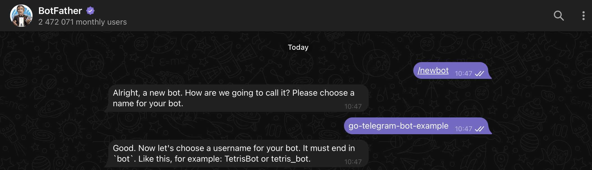
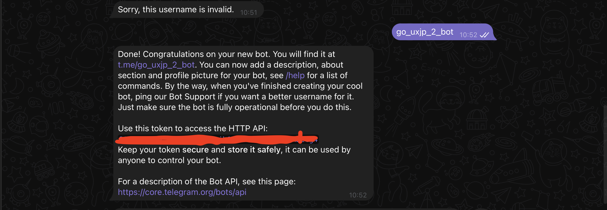
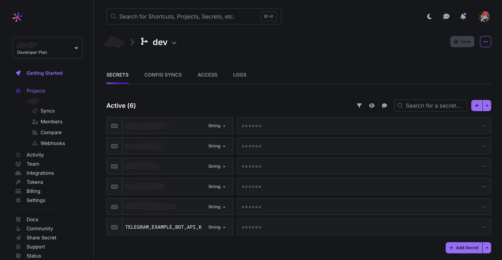
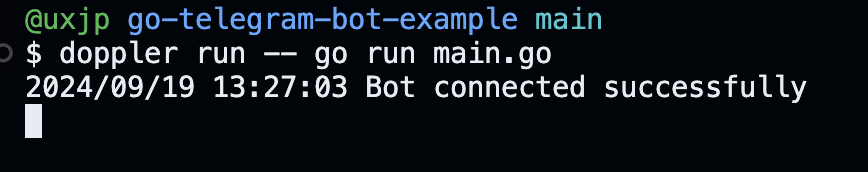
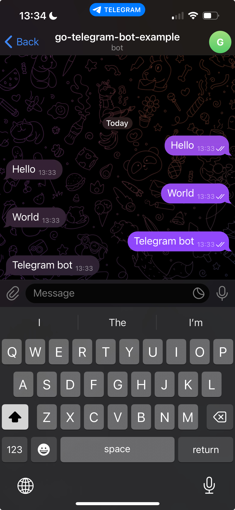

# go-telegram-bot-example

This repo serves as a starting point for developing Telegram Bots with golang.  
This `README.md` contains a comprehensive step-by-step guide that I used for setting up the bot.

## Security

I personally consider using `.env` files a bad practice, so I don't use them to store my Token.  
Why don’t I like it? Because I've accidentally committed secrets too many times. If that wasn’t reason enough, I also think it takes too much time to manually set up these `.env` files in numerous folders when handling multiple environments.
a
The scope of this repo is local development, and for this purpose, I'm storing my secrets with a free tool called  
`doppler.com`. It allows me to log in locally and have my secrets injected into my app while I execute the command to run it, like:

```bash
doppler run -- go run main.go
```

## BotFather

Using Telegram start a chat with [BotFather](https://telegram.me/BotFather) and demand a new bot with:
```
/newbot
```



It can get really annoying to choose a name valid name for your bot, so keep trying until:  



## Setup Environment Variable for Token

In my case I use doppler as I mentionned. Here how the dashboard looks like:  



## Setup Go dependencies

Initialize a Go module in your project directory:  
```bash
go mod init telegram-bot
```

Install the package of our main dependency [go-telegram/bot](https://github.com/go-telegram/bot) by running:

## What should you get

After running with:   
```bash
doppler run -- go run main.go
```



In your Telegram you should observe an echo behavior while you chat with the bot.  




From here you can improve your behavior handling and evolve your bot.  

### References

For this repo I used the example from the https://github.com/go-telegram/bot README.